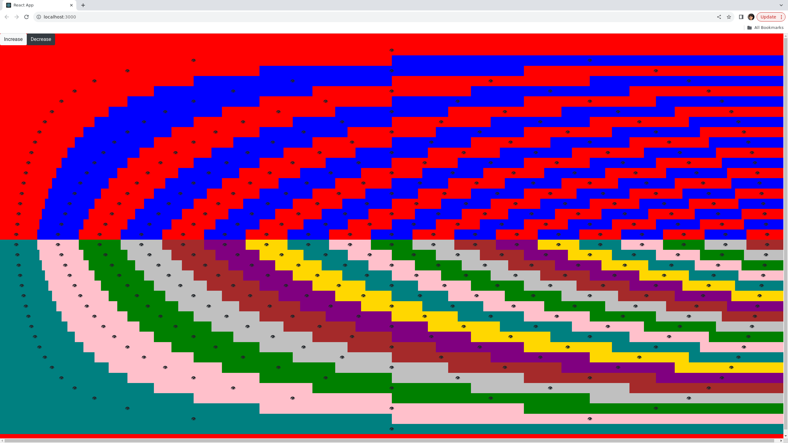

# About

Sorry about the misspelling (should be psychedelic). Doesn't affect the code though!

In 2023 this runs but only if you enter this into the terminal first:

export NODE_OPTIONS=--openssl-legacy-provider

Due to openssl issue with latest node versions.

## How to Run It

First, get the repo, by running the command git clone.

`git clone https://github.com/julianeon/psychedlic-eye.git`

Then, cd into the app's directory:

`cd psychedlic-eye`

Run this command, to install all the ncessary dependencies:

`npm install`

When that's done, run this command to actually run it:

`npm start`

Go to your browser address bar and type localhost:3000 to see the repeating eyes.

## Comments

Feel free to clone it, change the CSS, or do anything else you want with this repo, released under the MIT license.
